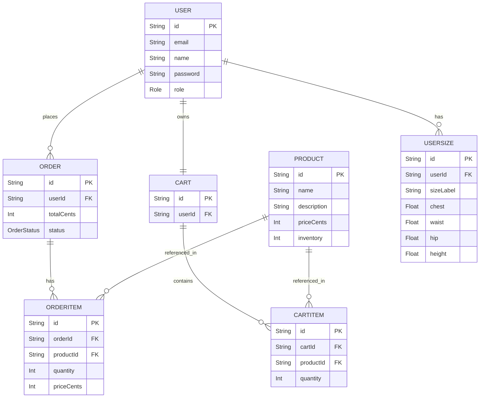

# Database schema (UN1-2)

## ER Diagram (Mermaid)



## How to run locally (Docker + Prisma)

- Copy `.env.example` to `backend/.env` and adjust if needed.
- Start PostgreSQL via Docker Compose from `backend` folder:

```bash
cd backend
npm run db:up
```

- Install dependencies (from `backend`):

```bash
npm install
```

- Generate Prisma client:

```bash
npx prisma generate
```

- Run migration (creates DB schema):

```bash
npx prisma migrate dev --name init
```

- Seed the database:

```bash
npm run db:seed
```

- Open Prisma Studio to inspect data:

```bash
npm run prisma:studio
```

## Checklist for PR

- [ ] ER diagram included in docs
- [ ] `docker-compose.yml` for Postgres
- [ ] `prisma/schema.prisma` with required models and relationships
- [ ] `prisma/seed.js` creating 3 users, 20 products, 5 orders
- [ ] scripts in `backend/package.json` to run migrate, seed, studio
